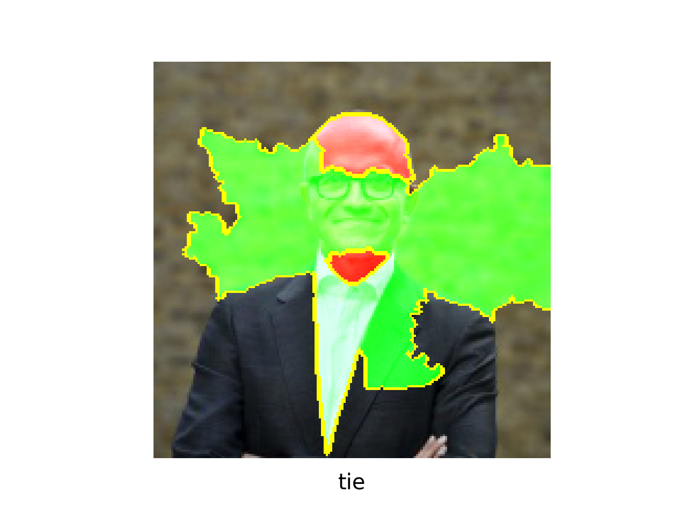
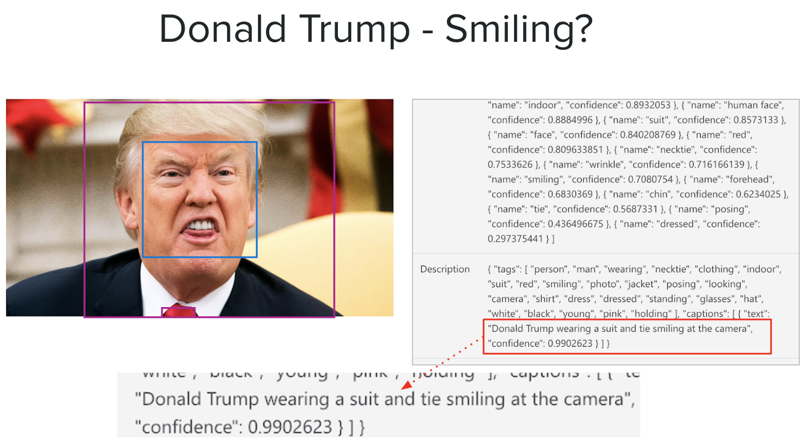
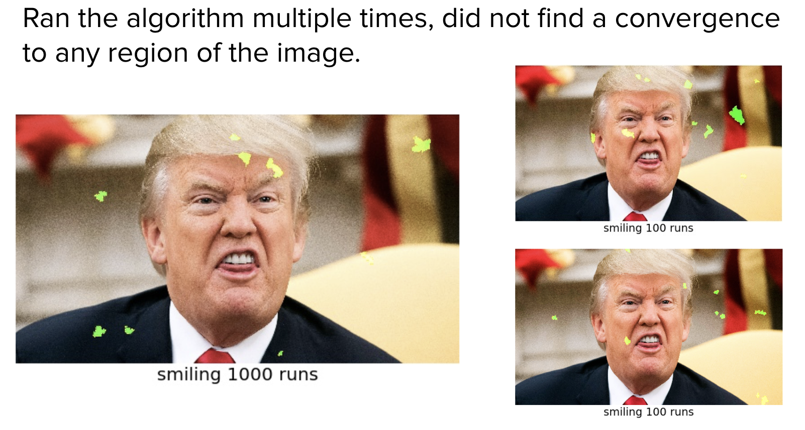
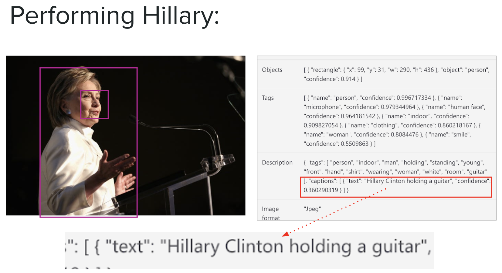

# LIME-on-Azure-Computer-Vision

Analysing Microsoft Cognitive Services Computer Vision software's predictions using LIME

## Examples

#### Satya Nadella - Missing Tie




#### President Donald Trump 





#### HIllary Clinton - with a Guitar




## What is LIME?

LIME is a tool used for explaining predictions of machine learning models. The following resource to [LIME](https://github.com/marcotcr/lime) is a great starting point to understand it.

LIME is based on the work presented in [this paper](https://arxiv.org/abs/1602.04938).

<a href="https://www.youtube.com/watch?v=hUnRCxnydCc" target="_blank"></a>

## Installation

The lime package is on [PyPI](https://pypi.python.org/pypi/lime). Use the following to install:

```sh
pip install lime
```

Install [PIL](https://pypi.python.org/pypi/Pillow/2.2.1):

```sh
pip install Pillow
```

Besides LIME and PIL, we utilise, matplotlib, numpy and skimage.segmentation

## Instructions to run the code
1. Have images in .jpeg or .jpg format.
2. Have a temporary folder with the image and the copy of the image you want to test
3. Run the following code with a stable internet connection.

```
python3 <file_name>.py <subscription_key> <endpoint> <image_path> <image_copy_path> <tag/caption/celebrity> <number_of_samples> 
```
